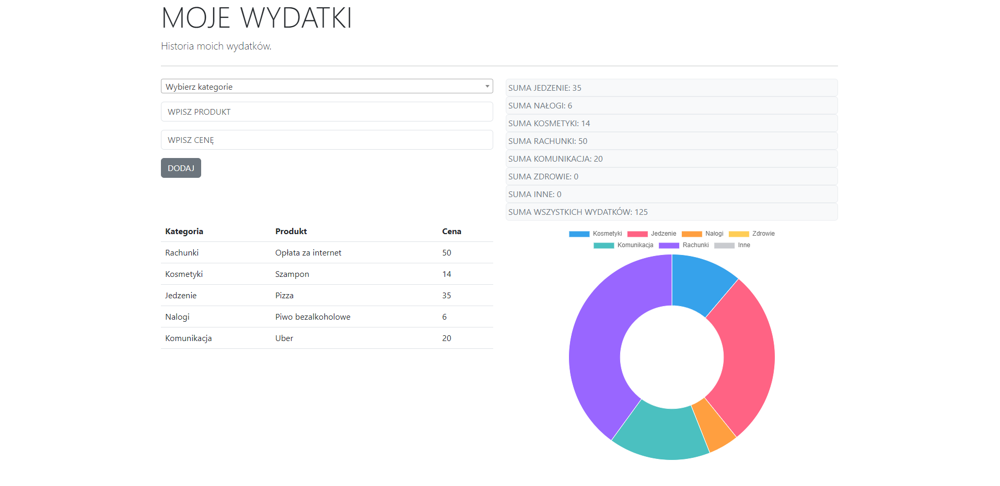

# LISTA WYDATKÓW

Wykonana w JS i HTML aplikacja do analizowania codziennych wydatków. 
Aplikacja umożliwia dodawanie produktów z podziałem na kategorię i zaprezentowanie danych na wykresie.
Projekt został ostylowany za pomocą Bootstrap.

